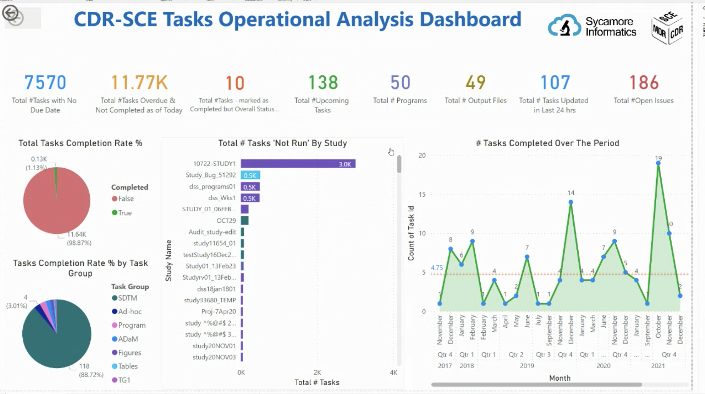

# CDRSCE.task.analysis.dashboard

> "Operational visibility for clinical reporting tasks"

[](https://lifecycle.r-lib.org/articles/stages.html#experimental)

## Overview

`CDRSCE.task.analysis.dashboard` is a modular, `{golem}`-based Shiny prototype for exploring clinical reporting task delivery. It brings operational KPIs and interactive visualizations together to highlight completion rates, pending deliverables, upcoming or overdue work, open issues, and delivery trends over time.



## Live demo

**Try it now:** 
Using the [github.io](https://ramdhadage.github.io/taskAnalysis/) deployment or the
[shinyapps.io](https://ti5syn-ramdhadage.shinyapps.io/CDRSCE_task_analysis/)

## Key features

- KPI-oriented views for task and output delivery
- Interactive charts built with `{plotly}` and `{echarts4r}`
- Reusable, namespaced Shiny modules
- Reproducible dependencies managed with `{renv}`

## Run locally

```bash
git clone https://github.com/Ramdhadage/taskAnalysis.git
cd taskAnalysis
```

From R:

```r
install.packages("renv") # Run once if renv is not installed
renv::restore()
shiny::runApp()
```
